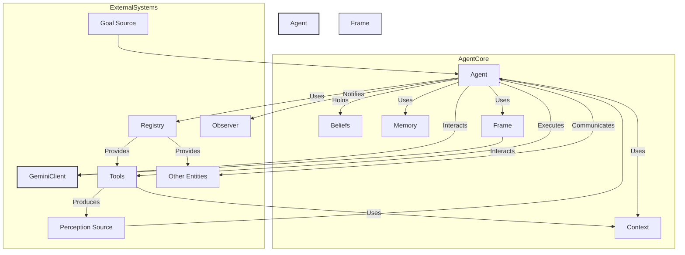
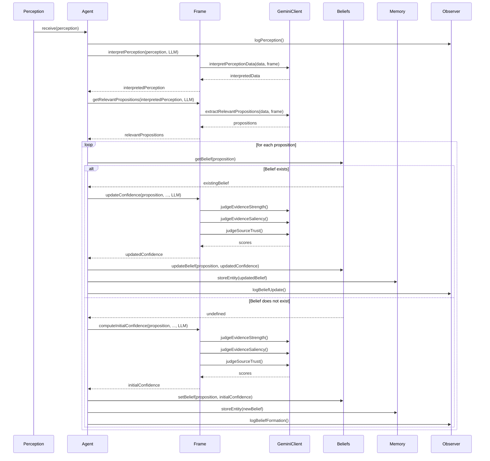
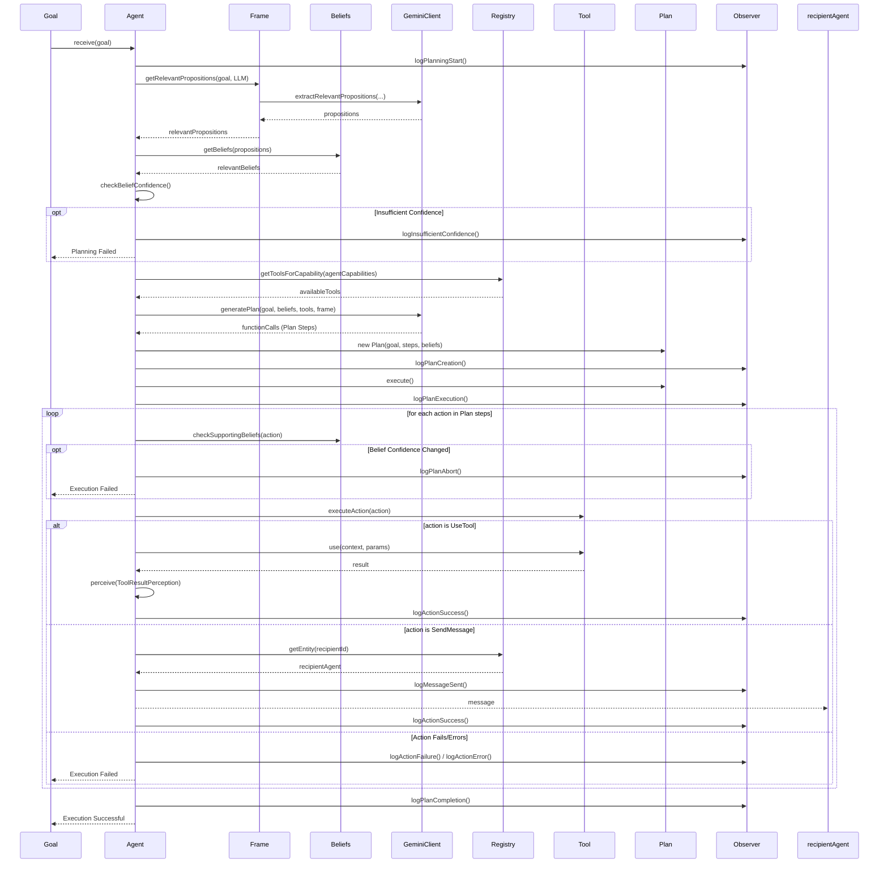
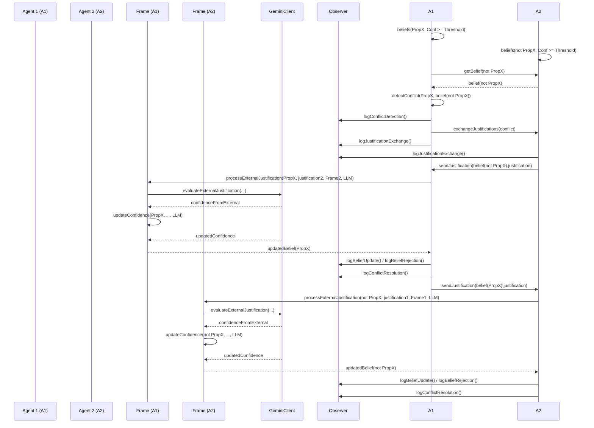

# Agentic Epistemology Framework (AEF) Implementation Documentation

## 1. Overview

This document describes the implementation of the Agentic Epistemology Framework (AEF), a system designed for building autonomous agents capable of sophisticated reasoning, planning, and interaction. The framework emphasizes how agents form, update, and justify their beliefs based on perceptions and interactions, using cognitive frames and leveraging Large Language Models (LLMs) for complex tasks.

### High-Level Component Interaction



## 2. Core Components (`src/core`)

These modules form the fundamental building blocks of an agent.

*   **`Agent` (`agent.ts`)**:
    *   The central entity representing an autonomous agent.
    *   Manages its internal state: `id`, `name`, `beliefs`, `memory`, current `frame`, `context`, and `capabilities`.
    *   Orchestrates the core agent lifecycle:
        *   `perceive()`: Processes incoming `Perception` objects.
        *   `updateBeliefs()`: Updates `Belief`s based on interpreted perceptions using the `Frame` and `GeminiClient`.
        *   `plan()`: Generates a `Plan` to achieve a `Goal` using `Belief`s, `Frame`, `Registry`, `Tool`s, and `GeminiClient`.
        *   `executePlan()` / `executeAction()`: Executes the steps in a `Plan`, utilizing `Tool`s or sending `Message`s.
        *   `detectConflicts()` / `exchangeJustifications()` / `processExternalJustification()`: Manages epistemic disagreements with other agents.
        *   `setFrame()`: Allows changing the agent's cognitive perspective.
    *   Relies heavily on the `Frame` and `GeminiClient` for reasoning and decision-making tasks.
    *   Interacts with `Memory` for storage, `Registry` for discovery, and `Observer` for logging.

*   **`Memory` (`memory.ts`)**:
    *   Defines the interface (`Memory`) for persistent storage of agent knowledge (primarily `Belief`s).
    *   `DefaultMemory`: A simple in-memory implementation using a `Map`. Stores entities with timestamps and access counts.
    *   `SemanticMemory`: An advanced implementation using vector embeddings (provided by an external `vectorize` function, potentially `GeminiClient`) and cosine similarity for semantic retrieval.
    *   Used by the `Agent` to store beliefs after formation/update.

*   **`Registry` (`registry.ts`)**:
    *   Acts as a central service discovery mechanism.
    *   Stores `Entity`s (like other `Agent`s) and `Tool`s, mapping them by ID.
    *   Maintains a mapping from `Capability`s to the entities/tools that provide them.
    *   Used by `Agent`s to:
        *   Find available `Tool`s based on their own `Capability`s during planning.
        *   Look up recipient `Entity`s when sending messages.
        *   Discover other `Agent`s for conflict detection.

*   **`Context` (`context.ts`)**:
    *   A transient container holding information relevant to the current action or situation (e.g., data from recent perceptions).
    *   Passed to `Tool.use()` methods to provide operational context.
    *   Distinct from `Memory`, which is for long-term storage.

*   **`Perception` (`perception.ts`)**:
    *   Represents information received by the agent from its environment or internal processes (e.g., `ToolResultPerception`).
    *   Contains `data`, `source`, `timestamp`, and methods to get contextual/justification elements.
    *   Processed by the `Agent.perceive()` method.

*   **`Entity` (`entity.ts`)**:
    *   A base interface/class for anything registered in the `Registry`, including `Agent`s. Defines basic properties like `id`, `type`, `name`, and optional `capabilities`.

## 3. Epistemic Engine (`src/epistemic`)

This set of modules handles the agent's knowledge representation, reasoning, and belief management.

*   **`Belief` (`belief.ts`)**:
    *   Represents a proposition held by the agent, associated with a `confidence` level (0-1) and a `Justification`.
    *   Stored in the `Agent`'s belief map and persisted in `Memory`.
    *   Confidence determines the agent's willingness to act on or communicate the belief.

*   **`Justification` (`justification.ts`)**:
    *   Provides support or evidence for a `Belief`.
    *   Composed of `JustificationElement`s, which can be of different types (e.g., `Observation`, `ToolResult`, `Testimony`, `Inference`, `ExternalJustification`).
    *   Used by the `Frame` and `GeminiClient` to calculate belief confidence.

*   **`Frame` (`frame.ts`)**:
    *   An abstract class representing a cognitive lens or perspective that influences how the agent interprets information and reasons.
    *   Defines abstract methods for:
        *   `interpretPerception()`: Processing raw perception data.
        *   `getRelevantPropositions()`: Identifying key statements in data/goals.
        *   `computeInitialConfidence()` / `updateConfidence()` / `recomputeConfidence()`: Calculating belief confidence based on justifications.
        *   `evaluateExternalJustification()`: Assessing justifications from other agents.
    *   Concrete implementations (`EfficiencyFrame`, `ThoroughnessFrame`, `SecurityFrame`) provide specific logic, often delegating heavily to the `GeminiClient` based on frame-specific prompts and parameters.
    *   Defines `FrameParameters` (weights, rates, thresholds) that tune its behavior.
    *   `FrameFactory` allows creating frames by name.

*   **`Conflict` (`conflict.ts`)**:
    *   `EpistemicConflict`: Represents a disagreement between two agents holding contradictory beliefs with sufficient confidence.
    *   The `Agent` detects conflicts and initiates a resolution process involving `exchangeJustifications()` and `processExternalJustification()`, relying on the `Frame` and `GeminiClient` to re-evaluate beliefs based on the exchanged evidence and frame compatibility.

## 4. Action Subsystem (`src/action`)

These modules define how agents pursue goals and interact with the world.

*   **`Goal` (`goal.ts`)**:
    *   Represents an objective the agent aims to achieve. Contains a `description` and potentially priority/status.
    *   Triggers the `Agent.plan()` method.

*   **`Capability` (`capability.ts`)**:
    *   An abstract representation of an agent's ability (e.g., `DataAnalysis`, `SecurityScan`, `TextGeneration`).
    *   Agents possess a set of `Capability`s.
    *   `Tool`s implement one or more `Capability`s.
    *   Used by the `Registry` to map capabilities to the tools/entities that provide them.

*   **`Tool` (`tool.ts`)**:
    *   Interface (`Tool`) and base class (`BaseTool`) for functionalities agents can execute.
    *   Each tool has an `id`, `name`, `description`, `parameterSchema`, `outputSchema`, associated `capabilities`, and a `use()` method.
    *   `FunctionTool`, `InformationTool`, `ExternalSystemTool` provide common patterns.
    *   Specific tools (`DataAnalysisTool`, `SecurityScanTool`, etc.) implement concrete actions.
    *   Registered in the `Registry` and discovered by agents during planning based on required `Capability`s.
    *   The `GeminiClient` uses tool definitions (name, description, schema) to generate function calls during planning.

*   **`Plan` (`plan.ts`)**:
    *   A sequence of `Action` steps generated by the `GeminiClient` (via `Agent.plan()`) to achieve a `Goal`.
    *   Associated with the `Goal` and the `Belief`s used during planning.
    *   Executed step-by-step by the `Agent`.

*   **`Action` (`action.ts`)**:
    *   Represents a single step within a `Plan`.
    *   `UseTool`: An action to execute a specific `Tool` with given `parameters`.
    *   `SendMessage`: An action to send a `Message` to another `Entity`.

*   **`Message` (`message.ts`)**:
    *   Represents communication between agents, containing `sender`, `recipient`, `content`, and `timestamp`.

## 5. LLM Interface (`src/llm`)

*   **`GeminiClient` (`gemini-client.ts`)**:
    *   Acts as the interface to the Google Gemini LLM.
    *   Initialized with an API key and model name.
    *   Provides methods called by the `Agent` and `Frame`:
        *   `generatePlan()`: Uses Gemini's function calling capability to create a sequence of `UseTool` actions based on the goal, beliefs, available tools (from `Registry`), and the agent's current `Frame`. Constructs specific prompts detailing the context.
        *   `interpretPerceptionData()`: Asks Gemini to reinterpret perception data based on the active `Frame`.
        *   `extractRelevantPropositions()`: Asks Gemini to identify key propositions from perception data or goal descriptions relevant to the `Frame`.
        *   `judgeEvidenceStrength()`: Asks Gemini for a score (0-1) indicating how strongly evidence supports/contradicts a proposition.
        *   `judgeEvidenceSaliency()`: Asks Gemini for a score (0-1) indicating the relevance/importance of evidence from the perspective of the current `Frame`.
        *   `judgeSourceTrust()`: Asks Gemini for a score (0-1) indicating the trustworthiness of an evidence source, considering the `Frame`.
    *   Uses carefully constructed prompts for each task, incorporating frame details and instructions for the desired output format (often a single numerical score).

## 6. Observation (`src/observer`)

*   **`Observer` (`observer.ts`)**:
    *   Defines the `Observer` interface for logging agent activities.
    *   Includes methods for logging various events: belief changes, perception, planning stages, action execution, conflicts, frame changes, messages, etc.
    *   `BaseObserver`: A default implementation that stores events in memory using an `EventFactory` and notifies registered listeners.
    *   Allows decoupling the agent's core logic from monitoring and debugging mechanisms.

*   **`Event Types` (`event-types.ts`)**:
    *   Defines the structure for different event types logged by the `Observer` (e.g., `BeliefFormationEvent`, `PlanCreationEvent`, `ActionExecutionEvent`).
    *   Includes an `EventFactory` to create instances of these event types.

## 7. Data Flow Diagrams

### Diagram 1: Overall Component Interaction


### Diagram 2: Perception-to-Belief Update Cycle



### Diagram 3: Goal-to-Action Execution Cycle



### Diagram 4: Conflict Detection & Resolution Flow



### Diagram 5: Role of `Frame` and `GeminiClient` in Reasoning

```mermaid
graph LR
    subgraph AgentReasoning
        Agent -- Uses --> Frame;
        Frame -- Delegates Tasks --> GeminiClient;
        Beliefs -- Influenced by --> Frame;
        Plan -- Generated via --> GeminiClient;
    end

    subgraph GeminiTasks
        T1[Interpret Perception]
        T2[Extract Propositions]
        T3[Judge Evidence Strength]
        T4[Judge Evidence Saliency]
        T5[Judge Source Trust]
        T6[Calculate Confidence]
        T7[Generate Plan (Function Calling)]
    end

    GeminiClient -- Performs --> T1;
    GeminiClient -- Performs --> T2;
    GeminiClient -- Performs --> T3;
    GeminiClient -- Performs --> T4;
    GeminiClient -- Performs --> T5;
    GeminiClient -- Performs --> T6;
    GeminiClient -- Performs --> T7;

    Frame -- Uses Result --> T1;
    Frame -- Uses Result --> T2;
    Frame -- Uses Result --> T3;
    Frame -- Uses Result --> T4;
    Frame -- Uses Result --> T5;
    Frame -- Uses Result --> T6;
    Agent -- Receives Plan --> T7;

    style GeminiClient fill:#f9d,stroke:#333,stroke-width:2px;
    style Frame fill:#ccf,stroke:#333,stroke-width:1px;
